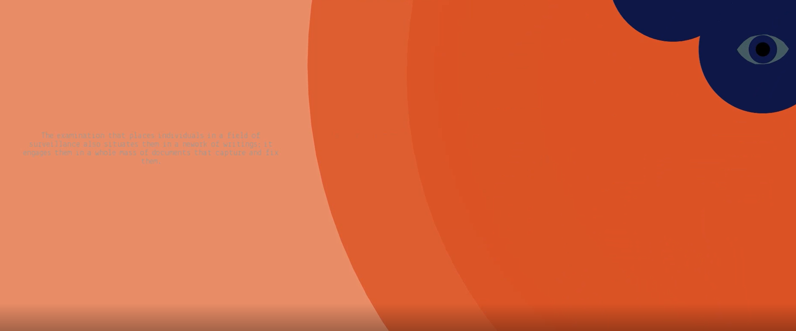

## Eye of Power

### Concept

In the book ‘The Eye of Power’, Michel Foucault discusses the history of social production and organization of space. He articulates how architecture has been primarily concerned with the functionality and a modality that stems from architecture for divinity. Foucault highlights that architecture can also be used as a method of suppression. I have been thinking alot about surveillance in this time of COVID 19, and how in fear, people are less concerned about compromising their rights to privacy. I have left complacent in demanding more from the technology. This is part one of an ongoing story.

Reference: https://www.nytimes.com/2020/03/23/technology/coronavirus-surveillance-tracking-privacy.html

### Sketches and iterations

YouTube Link : https://www.youtube.com/watch?v=2x1q-ki3pb4

### How you translated the concept into something concrete

I used time as a metaphor for power and used moving eyes as a symbol for how we not only keeping track of time as a way to be productive.

- I started off by creating graphics and style board. Once

### User

### How you might develop the concept more in future iterations

There are a few additional scenes

### Your estimation of successes and potential shortcomings of your translation
